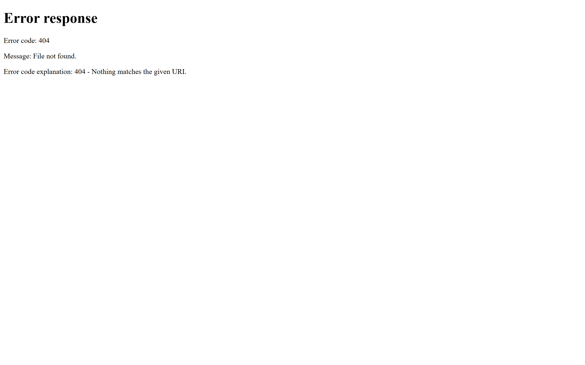

# Candy Cascade

A colorful puzzle game built with Flutter and deployed as a web application.

## 🎮 Play the Game

Visit the live website: [https://innnervision.github.io/Candy-Cascade/](https://innnervision.github.io/Candy-Cascade/)

## 📸 Screenshots

### Home Screen

### Map View

### Level 1

### Level 2

### Win Screen

## 🚀 Features

- Match-3 puzzle gameplay
- Multiple levels with increasing difficulty
- Vibrant graphics and animations
- Progress tracking
- Power-ups and special candies

## 🛠️ Tech Stack

- Flutter
- Dart
- Firebase (for backend services)

## 📝 License

This project is open source and available under the MIT License.
